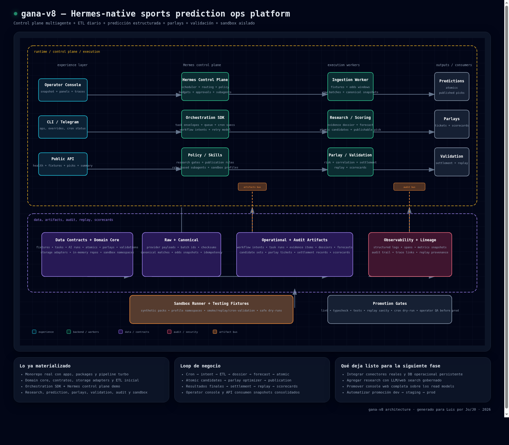

# gana-v8

Hermes-native sports prediction ops platform.

## Diagrama de arquitectura



Versión navegable: `docs/architecture/gana-v8-architecture.html`

## Qué incluye la plataforma

El monorepo ya materializa la base operativa de gana-v8 con:

- workspaces reales en `apps/*` y `packages/*`
- configuración TypeScript compartida para apps y paquetes
- scripts uniformes de `build`, `lint`, `test`, `typecheck` y `clean`
- workers, API interna, consola operativa y runtime persistido de tareas
- sólo rutas materializadas en git cuando ya existe contenido real

El layout completo vive en `docs/plans/`, especialmente en `docs/plans/gana-v8-monorepo-layout.md`. Directorios como `data-contracts/`, `fixtures/`, `infra/`, `notebooks/`, `registry/`, `scripts/`, `tests/` y partes de `docs/` se crean a medida que tengan artefactos concretos.

## Entrada rápida para agentes

- `AGENTS.md`: entry point corto del repo para orientación inicial.
- `docs/README.md`: mapa documental, taxonomía y lifecycle de documentos.
- `docs/harness-principios-dorados.md`: contrato canónico de reglas bloqueantes, guidelines y excepciones temporales del harness.
- `docs/agentic-handoff.md`: contrato de subagentes, handoff y aislamientos de trabajo.
- `docs/agentic-sprint-contract.md`: contrato para sprint agentic no trivial, roles, baseline y validación.
- `docs/agentic-evaluation-rubric.md`: rúbrica para evaluador separado y salida `promotable`/`review-required`/`blocked`.
- `docs/plans/falta/`: fuente de verdad para gaps activos del repo.
- `runbooks/README.md`: índice canónico para elegir procedimientos operativos activos.
- `skills/gana-v8-verification-guard/`: skill reusable versionada en git para escalonar verificaciones costosas del monorepo sin depender de `~/.codex/skills`.

## Workspaces incluidos

### Apps
- `apps/hermes-control-plane` (compatibilidad temporal para imports y tests legacy)
- `apps/hermes-scheduler`
- `apps/hermes-dispatcher`
- `apps/hermes-recovery`
- `apps/operator-console`
- `apps/public-api`
- `apps/scoring-worker`
- `apps/ingestion-worker`
- `apps/research-worker`
- `apps/validation-worker`
- `apps/publisher-worker`
- `apps/sandbox-runner`

### Packages
- `packages/domain-core`
- `packages/contract-schemas`
- `packages/orchestration-sdk`
- `packages/source-connectors`
- `packages/canonical-pipeline`
- `packages/research-contracts`
- `packages/research-engine`
- `packages/feature-store`
- `packages/model-registry`
- `packages/prediction-engine`
- `packages/parlay-engine`
- `packages/validation-engine`
- `packages/publication-engine`
- `packages/policy-engine`
- `packages/audit-lineage`
- `packages/observability`
- `packages/config-runtime`
- `packages/control-plane-runtime`
- `packages/storage-adapters`
- `packages/queue-adapters`
- `packages/authz`
- `packages/testing-fixtures`
- `packages/dev-cli`

## Comandos

```bash
pnpm install
pnpm lint
pnpm typecheck
pnpm test
pnpm verify
pnpm harness:scorecard
pnpm test:sandbox:certification
pnpm build
```

## Superficies operativas

La topología operativa recomendada ya no es `apps/hermes-control-plane`. El runtime primario queda repartido entre `packages/control-plane-runtime` y estas apps:

- `apps/hermes-scheduler` para materializar cron specs y registrar ciclos de scheduling
- `apps/hermes-dispatcher` para reclamar tareas persistidas, ejecutar workers y registrar ciclos de dispatch
- `apps/hermes-recovery` para resumir salud de cola, recovery y redrive

`apps/hermes-control-plane` se conserva sólo como capa de compatibilidad temporal para tests, imports y flujos legacy mientras termina la migración.

`public-api` puede correrse como servicio HTTP interno:

```bash
pnpm --filter @gana-v8/public-api serve
```

Si definís `GANA_PUBLIC_API_VIEWER_TOKEN` y/o `GANA_PUBLIC_API_OPERATOR_TOKEN`, el servicio exige `Authorization: Bearer ...`.

La consola web de operación corre separada y consume solo `public-api`:

```bash
pnpm --filter @gana-v8/operator-console serve:web
```

La consola ahora también muestra `sandbox certification`, un inspector dedicado de `runtime-release`, `promotion-gates` y la traza auditable de policy/capabilities por perfil usando `public-api`.

Variables clave:

- `GANA_OPERATOR_CONSOLE_PUBLIC_API_URL`
- `GANA_OPERATOR_CONSOLE_PUBLIC_API_TOKEN`
- `GANA_PUBLIC_API_PORT`
- `GANA_OPERATOR_CONSOLE_PORT`

Para trabajo agentic o validacion local aislada, el bootstrap canonico por worktree vive en `scripts/workspace-dev.mjs` y en el runbook `runbooks/worktree-bootstrap-validation.md`:

```bash
pnpm harness:bootstrap -- --worktree-id codex-harness --base-port 4100 --skip-db
pnpm harness:serve -- --worktree-id codex-harness --base-port 4100
pnpm harness:validate -- --worktree-id codex-harness --base-port 4100 --level smoke
pnpm harness:clean -- --worktree-id codex-harness
```

La validacion `smoke` arranca `public-api` y `operator-console`, prueba las superficies HTTP/HTML vivas y deja evidencia en `.artifacts/workspace-dev/<worktree-id>/`.

## Sandbox y certification

La certificación determinística de sandbox usa goldens versionadas en `fixtures/replays/goldens/` y genera evidence packs en `.artifacts/sandbox-certification/`:

```bash
pnpm test:sandbox:certification
```

Perfiles certificados actualmente:

- `ci-smoke`
- `ci-regression`
- `staging-like`
- `hybrid`
- `chaos-provider`
- `human-qa-demo`

También podés correr un certificado puntual con el runner:

```bash
pnpm --filter @gana-v8/sandbox-runner certify -- --mode smoke --profile ci-smoke --pack football-dual-smoke --golden fixtures/replays/goldens/ci-smoke/football-dual-smoke.json --artifact .artifacts/sandbox-certification/ci-smoke/football-dual-smoke.evidence.json
```

Runbooks asociados:

- `runbooks/README.md`
- `runbooks/expensive-verification-triage.md`
- `runbooks/sandbox-certification.md`
- `runbooks/sandbox-certification-drift.md`

## Release ops y runbooks

CI conserva la certificación sintética en `sandbox-certification` y agrega el gate MySQL-backed `runtime-release` para ejecutar el runtime durable de scheduler, dispatcher y recovery contra Prisma/MySQL real.

`runtime-release` resuelve defaults operativos por perfil de evidencia:

- `ci-ephemeral`: reloj congelado `2100-01-02T00:00:00.000Z`, `lookback=48h`, no overrideable.
- `staging-shared`: reloj real, `lookback=72h`, aprobación humana del operador on-duty.
- `pre-release`: reloj real, `lookback=168h`, aprobación humana del release owner.

La evidencia de `runtime-release` ya persiste snapshots durables baseline/candidate y expone en `public-api`/`operator-console` la semántica de cobertura y truncación. `SANDBOX_CERT_BASELINE_SNAPSHOT_ID` y `SANDBOX_CERT_CANDIDATE_SNAPSHOT_ID` permiten apuntar a snapshots preexistentes; si no se definen, el gate captura candidate y resuelve baseline por perfil/ref.

La reproducción local mínima de ese gate es:

```bash
pnpm db:generate
pnpm db:migrate:deploy
pnpm --filter @gana-v8/control-plane-runtime test
pnpm test:runtime:release
GANA_RUNTIME_PROFILE=ci-smoke pnpm test:e2e:hermes-smoke
```

El smoke Hermes debe tratarse como smoke de procesos vivos de `hermes-scheduler`, `hermes-dispatcher` y `hermes-recovery`; si una corrida local o de CI cae a chequeos de imports/compile-only, documentar la degradación en el handoff.

Housekeeping de historia durable:

```bash
pnpm ops-history-retention -- --dry-run
pnpm ops-history-retention -- --apply
```

El índice canónico de runbooks vive en `runbooks/README.md`; desde ahí se enruta por objetivo, disparador, precondición y preparación de base de datos.

Runbooks operativos activos más usados:

- `runbooks/expensive-verification-triage.md`
- `runbooks/harness-garbage-collection.md`
- `runbooks/release-review-promotion.md`
- `runbooks/rollback.md`
- `runbooks/recovery-redrive.md`
- `runbooks/quarantine-manual-review.md`
- `runbooks/observability-traceability-incident.md`
- `runbooks/public-api-operator-console-read-model-staleness.md`
- `runbooks/smoke-e2e-runtime-failure.md`

## Base de datos por defecto

- Prisma y el runtime quedan orientados a MySQL como default de desarrollo.
- Copiá `.env.example` a `.env` y completá `DATABASE_URL` (y opcionalmente `DATABASE_ADMIN_URL`) con la conexión MySQL administrada en DigitalOcean.
- Para DigitalOcean managed MySQL sin CA local configurada, usá `sslaccept=accept_invalid_certs` en la URL
- El baseline actual de `prisma/migrations/` ya fue regenerado para MySQL.
- La matriz canónica de preparación vive en `runbooks/README.md`; release review, rollback, smoke y runtime durable usan migraciones versionadas.

## Convenciones del repo

- Cada workspace expone `src/index.ts` como punto de entrada mínimo.
- `build` compila a `dist/` con TypeScript.
- `lint` valida convenciones mínimas del workspace, su manifest y los invariantes documentales del repo-as-harness.
- `test` verifica que el artefacto compilado exporte metadata consistente.
- `typecheck` ejecuta TypeScript sin emitir artefactos.

## Skills versionadas

La skill reusable del repo vive en `skills/gana-v8-verification-guard/` con su `SKILL.md`, metadata de `agents/` y referencias auxiliares. La idea es que quede portable en git: se puede copiar a otro entorno Codex o instalarla desde la ruta del repo en GitHub sin depender de una carpeta local fuera del control de versiones.

## Próximos pasos naturales

- revisar thresholds de promoción y ventanas de evidencia con datos de operación reales
- endurecer dashboards históricos sobre los read models ya unificados de `public-api` y `operator-console`
- automatizar archival/export adicional si el volumen operativo supera la retención online de 90 días

## Planes clave

`docs/plans/falta/` es la fuente de verdad para planes activos. `README.md` y `docs/plans/README.md` deben mantenerse alineados con esa carpeta.

Activos:
- `docs/plans/falta/gana-v8-llm-web-research-evidence-pipeline.md`: fuerza web research vía LLM y convierte fuentes/citas en evidencia y claims accionables para destrabar research -> scoring.

Cierre reciente y contexto histórico:
- `docs/plans/completado/gana-v8-provider-market-alias-hardening.md`
- `docs/plans/completado/gana-v8-harness-evidencia-cobertura-y-remediacion-operativa.md`
- `docs/plans/archivado/2026-04-24-harness-falta-consolidado/`
- `docs/plans/completado/gana-v8-corners-experimental-guardrails.md`
- `docs/plans/completado/gana-v8-live-multimarket-provider-validation.md`
- `docs/plans/completado/gana-v8-market-line-extraction-hardening.md`
- `docs/plans/completado/gana-v8-corners-stats-prediction-validation.md`
- `docs/plans/completado/gana-v8-harness-principios-dorados-y-garbage-collection.md`
- `docs/plans/completado/gana-v8-multi-market-scoring-publishing-validation.md`
- `docs/plans/completado/gana-v8-multi-market-odds-taxonomy-ingestion.md`
- `docs/plans/completado/gana-v8-harness-worktree-bootstrap-y-validacion-ejecutable.md`
- `docs/plans/completado/gana-v8-harness-doc-gardening-y-runbooks.md`
- `docs/plans/completado/gana-v8-harness-contratos-agentic-y-evaluacion.md`
- `docs/plans/completado/gana-v8-harness-runtime-release-y-verificacion-fiel.md`
- `docs/plans/completado/gana-v8-runtime-release-adopcion-operativa.md`
- `docs/plans/completado/gana-v8-harness-verificacion-release-ops-y-runbooks.md`
- `docs/plans/completado/gana-v8-harness-runtime-durable.md`
- `docs/plans/completado/gana-v8-harness-core-y-claridad-agente.md`
- `docs/plans/completado/gana-v8-plan-cierre-plataforma-operacion.md`
- `docs/plans/completado/gana-v8-plan-cierre-data-research.md`
- `docs/plans/completado/hermes-v8-migracion-v7-a-v8-git-worktrees.md`
- `docs/plans/gana-v8-monorepo-layout.md`
- `docs/plans/completado/hermes-v8-blueprint-prediccion-partidos.md`
